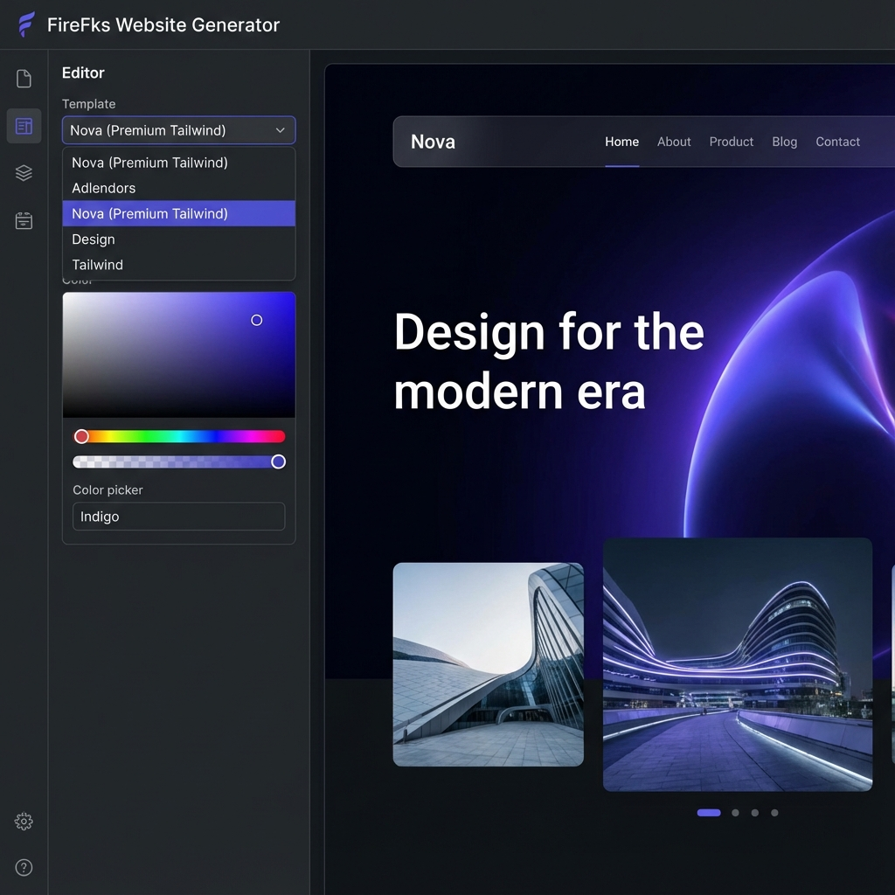

# Fire4s Project 1 (Week 1): Website Generator 🌶️

A rapid-prototyping tool for creating high-performance landing pages, built in collaboration with the **FireFks** team at **CAPACITI**.

## 🚀 Overview

This Week 1 delivery focuses on the core "Generator" engine. It allows non-technical users to input brand parameters (Headlines, Colors, CTA) and instantly see a production-ready landing page.

## ✨ Features (v3.0 - Nova Update)

- **🧠 AI Magic Generator**:
  - Type natural language prompts (e.g., "A cyberpunk gaming site") to instantly generate a full website.
  - Automatically selects the best template, colors, fonts, and writes the copy for you.
- **🔥 6 Premium Templates**:
  - **Nova**: Premium SaaS/Tech.
  - **Neon Cyberpunk**: Gaming & Web3.
  - **Corporate Pro**: Finance & Enterprise.
  - **Adlendors**: Creative Agency.
  - **Design**: Brutalist Portfolio.
  - **Tailwind**: Developer Documentation.
- **📱 Fully Responsive**: Mobile-first designs with floating glass navigation.
- **⚡ Real-Time Preview**: Instant updates with no build time.
- **🎨 Advanced Design Control**:
  - **Hero Alignment**: Toggle between Left and Center layouts.
  - **Feature Grid**: Customize a 3-column features section.
  - **Testimonials**: Add social proof with a dedicated testimonial block.
- **⚙️ SEO Ready**: Edit Page Titles and Meta Tags directly.
- **⬇️ Export HTML**: One-click download of the production-ready code.

## 🛠️ Technology Stack

- **Vite**: For lightning-fast development experience.
- **Vanilla JS**: Lightweight state management for the generator logic.
- **CSS3 / Glassmorphism**: For the premium editor workspace.

## 🤝 Collaboration
Built with the FireFks team to streamline the web creation process for CAPACITI projects.

## 📦 Getting Started

1. `cd Fire4s_Project1_Week1`
2. `npm install`
3. `npm run dev`

---
*Created by Raphasha & The FireFks Team*
