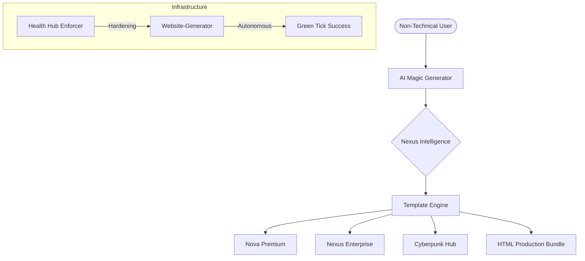

# 🏛️ KIROV DYNAMICS | WEBSITE GENERATOR

> **"Rapid Prototyping for a Digital Future."**

## 🖼️ Visual Showcase

---
A rapid-prototyping tool for creating high-performance landing pages, built in collaboration with the **Kirov Dynamics** team at **CAPACITI**.

## 🚀 Architecture: Kirov Nexus Protocol

```mermaid
graph TD
    User([Non-Technical User]) --> Prompt[AI Magic Generator]
    Prompt --> Brain{Nexus Intelligence}
    Brain --> Template[Template Engine]
    Template --> Nova[Nova Premium]
    Template --> Nexus[Nexus Enterprise]
    Template --> Neon[Cyberpunk Hub]
    Template --> Export[HTML Production Bundle]
    
    subgraph Infrastructure
        HealthHub[Health Hub Enforcer] -- Hardening --> Repo[Website-Generator]
        Repo -- Autonomous --> Deployment[Green Tick Success]
    end
```

## ✨ Features (v4.0 - Enterprise Edition)

- **🧠 Nexus Intelligence Engine**:
  - Re-engineered with modular template logic.
  - Type complex prompts to deploy high-end enterprise landing pages.
- **💎 Nexus Enterprise Template**:
  - Our most advanced design yet.
  - Features glassmorphism, depth-based layout, and premium Kirov Dynamics branding.
- **⚡ Zero-Latency Preview**:
  - Instant visual feedback powered by the modular rendering stack.
- **🏛️ Health Hub Integration**:
  - **Success Lock-in**: All deployments are monitored by the Health Hub v4.0 engine.
  - **Zero-Noise**: Dependabot is configured for silent hardening without approval overhead.
  - **Billing Protection**: Automated cancellation of redundant CI runs to save cloud costs.

## 🛠️ Technology Stack

- **Modular JS Engine**: Decoupled template architecture for rapid scaling.
- **Tailwind CSS JIT**: High-performance utility styling.
- **Glassmorphism 2.0**: Premium visual effects using backdrop-blur and radial meshes.

## 🤝 Collaboration
Built with the **Kirov Dynamics** team to streamline the web creation process for CAPACITI projects.

## 📦 Getting Started

1. `cd website_gen`
2. `npm install`
3. `npm run dev`

---
*Developed by Raphasha27 - Kirov Dynamics 2026.*

